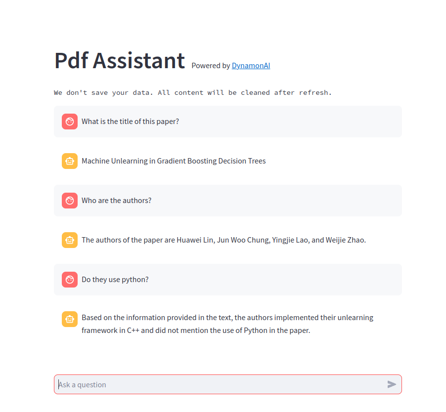

English | [中文文档](documentations/README_Chinese.md)

# Paper Assistant

[](https://github.com/huawei-lin/LLMsEasyFinetune/blob/master/LICENSE)
[](https://www.python.org/downloads/release/python-390/)

This repo implrements an easy-deployed assistant that can help you to understand pdf files, especially for scholar paper, supporting English, Chinese and multuple languages. We provide a web UI and demo.

Try our demo: [](https://dynamonai-pdf-assistant.streamlit.app/)

## TODO

- [ ] Support long context windows
- [ ] Support multiple languages
- [ ] Support multiple API (Gemma, Anthropic, etc)
- [ ] Improve performance
- [ ] More interactive operations


## Quick Start

Create an environment and install all dependencies.

```bash
conda create -n pdf_assistant python=3.10
conda activate pdf_assistant
pip install -r requirements.txt
```

Deploy UI by streamlit
```bash
streamlit run main.py
```

## Web UI


