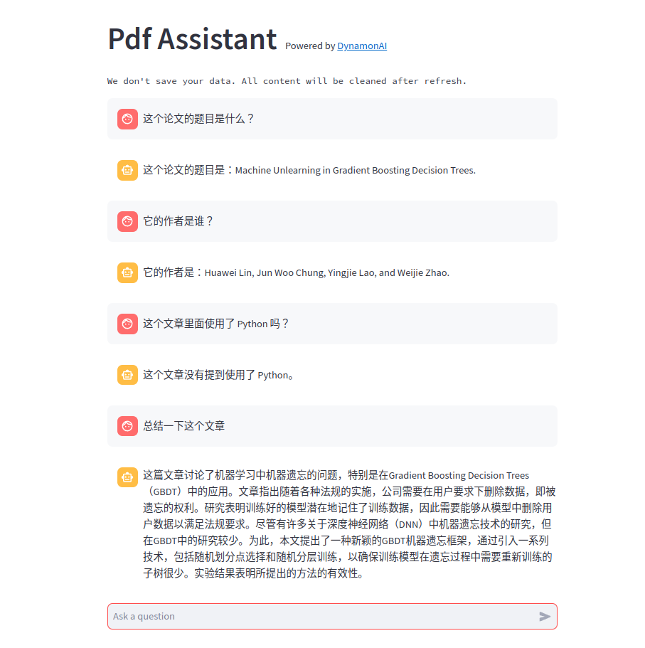

[English](../README.md) | 中文文档

# Paper Assistant

[](https://github.com/huawei-lin/LLMsEasyFinetune/blob/master/LICENSE)
[](https://www.python.org/downloads/release/python-390/)

该仓库基于大语言模型的API（OpenAI，Gemma，Anthropic）实现了一个易于部署的助手，可以帮助您阅读 pdf 文件，特别是学术论文，并支持英语、中文和多种语言。 此外，我们提供 Web UI 和 Demo。


尝试我们的 Demo: [](https://dynamonai-pdf-assistant.streamlit.app/)

## TODO

- [ ] 支持长文本窗口
- [ ] 支持多种语言
- [ ] 支持多种 API (Gemma, Anthropic, etc)
- [ ] 提高性能
- [ ] 支持更多交互操作


## 快速开始

创建环境并安装所有依赖项。

```bash
conda create -n pdf_assistant python=3.10
conda activate pdf_assistant
pip install -r requirements.txt
```

通过 streamlit 部署 UI

```bash
streamlit run main.py
```

## Web UI


